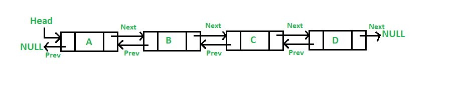

# Doubly Linked List Implementation

This document explains the current Java implementation of the **Doubly Linked List**.

## Structure

The implementation contains:

- `Doubly_Node`
- `DoublyLinkedList`

## Doubly_Node

```java
public class Doubly_Node {
    Object data;
    Doubly_Node next;
    Doubly_Node previous;

    public Doubly_Node(Object data){
        this.data = data;
        this.next = null;
        this.previous = null;
    }
}
```

Each node stores:

- `data`
- `next`
- `previous`

This allows the list to be traversed in both directions.

## Visual Representation



Conceptually:

```text
NULL ← [A] ⇄ [B] ⇄ [C] ⇄ [D] → NULL
        ↑                         ↑
       Head                      Tail
```

Each connection contains two references:

```text
previous ← node → next
```

## DoublyLinkedList

The list maintains:

```java
private Doubly_Node head;
private Doubly_Node tail;
private int length;
```

### Head

References the first node.

### Tail

References the last node.

### Length

Stores the number of nodes.

## append

```java
public void append(Object item)
```

A new node is added at the end.

For a non-empty list:

```text
tail.next = newNode
newNode.previous = tail
tail = newNode
```

Because the list maintains `tail`, append takes **O(1)** time.

## prepend

```java
public void prepend(Object item)
```

A new node is added before the current head.

For a non-empty list:

```text
newNode.next = head
head.previous = newNode
head = newNode
```

The operation is normally **O(1)**.

### Current implementation note

The current method assumes that `head` already exists:

```java
head.previous = node;
```

If `prepend` is called on an empty list, `head` is `null`, so this causes a `NullPointerException`.

The empty-list case should also establish both `head` and `tail`.

## showList

```java
public void showList()
```

The method starts at `head` and follows each node's `next` reference.

This is forward traversal and takes **O(n)** time.

Although the structure supports backward traversal through `previous`, the current `showList` method does not demonstrate that operation.

## Advantages of a Doubly Linked List

Compared with a singly linked list, a doubly linked list provides:

- Forward traversal through `next`.
- Backward traversal through `previous`.
- Easier removal of a known node.
- More direct navigation to the previous node.

## Trade-off

Every node stores an additional reference:

```text
Singly:
[data | next]

Doubly:
[previous | data | next]
```

Therefore, a doubly linked list requires more memory per node.

## Complexity Summary

| Operation | Complexity |
|---|---:|
| Append with tail | O(1) |
| Prepend | O(1) |
| Forward traversal | O(n) |
| Search | O(n) |
| Access by position | O(n) |
| Remove known node | O(1) |
| Reverse traversal | O(n) |

The O(1) removal case assumes that the node/reference to remove is already known. Finding that node first can still require **O(n)** traversal.

## Learning Focus

This implementation demonstrates:

- Two-way node references
- `head` and `tail`
- `next` and `previous`
- Forward traversal
- Constant-time insertion at the ends
- The memory trade-off of storing an additional reference
