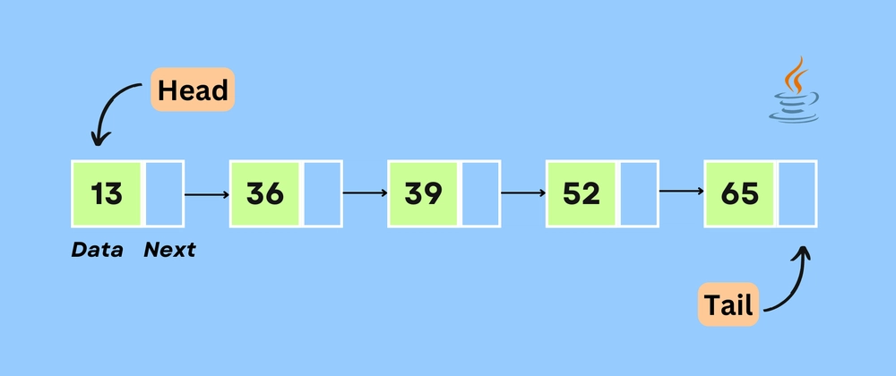

# Singly Linked List Implementation

This document explains the current Java implementation of the **Singly Linked List**.

## Structure

The implementation contains two classes:

- `Single_Node`
- `SingleLinkedList`

## Single_Node

```java
public class Single_Node {
    Object data;
    Single_Node next;

    public Single_Node(Object data){
        this.data = data;
        this.next = null;
    }
}
```

Each node contains:

- `data` — the value stored by the node.
- `next` — a reference to the next node.

The last node has:

```text
next = null
```

## Visual Representation



The list can be viewed conceptually as:

```text
Head
  ↓
[13 | Next] → [36 | Next] → [39 | Next] → [52 | Next] → [65 | Next] → null
                                                                            ↑
                                                                           Tail
```

## SingleLinkedList

The list maintains:

```java
private Single_Node head;
private Single_Node tail;
private int length;
```

### Head

`head` references the first node.

### Tail

`tail` references the last node.

### Length

`length` stores the number of nodes in the list.

## Append

```java
public void Append(Object item)
```

`Append` adds a new node to the end of the list.

If the list is empty, both `head` and `tail` point to the new node.

Otherwise:

```text
tail.next → new node
tail      → new node
```

Because the implementation maintains a `tail` reference, append is **O(1)**.

## Prepend

```java
public void prepend(Object item)
```

`prepend` adds a new node at the beginning.

Conceptually:

```text
new node → old head
head      → new node
```

The operation is normally **O(1)**.

### Current implementation note

The current `prepend` implementation does not update `tail` when the list is initially empty. If the class invariant requires both `head` and `tail` to reference the only node, this edge case should be handled.

## showList

```java
public void showList()
```

Starts at `head` and follows `next` until it reaches `null`.

This is a standard linked-list traversal and takes **O(n)** time.

## insert

```java
public void insert(Object item, Object position)
```

The method searches for the node whose data equals `position` and attempts to insert the new item after it.

The search itself takes **O(n)** in the worst case.

### Important implementation note

The current middle-insertion code is:

```java
current.next = itemNode;
itemNode.next = current.next.next;
```

After the first statement, `current.next` already points to `itemNode`. Therefore, the original successor is no longer available through `current.next`.

The conceptual safe order is:

```text
itemNode.next = current.next
current.next = itemNode
```

This preserves the original successor before changing `current.next`.

## remove

```java
public void remove(Object position)
```

The method searches for a node containing the requested value and removes it by changing references.

For a middle node:

```text
previous.next → current.next
```

This bypasses the node being removed.

### Current implementation notes

There are several edge cases to be aware of:

1. The head comparison uses `==`:

   ```java
   if (head.data == position)
   ```

   For general `Object` value comparison, `.equals()` is normally the appropriate comparison.

2. The head-removal branch does not decrement `length`.

3. Removing the only node should also leave the list's `tail` consistent.

4. The later check for `head.data.equals(position)` inside the traversal is redundant because the head was already checked before the loop.

## reverse

```java
public void reverse()
```

The implementation reverses the links in-place.

It uses three references:

- `current`
- `prev`
- `next`

The core idea is:

```text
current.next = prev
```

Then the references move forward until every link has been reversed.

### Complexity

- Time: **O(n)**
- Extra space: **O(1)**

The operation changes the existing nodes rather than creating a second list.

## Complexity Summary

| Operation | Complexity |
|---|---:|
| Append | O(1) |
| Prepend | O(1) |
| Search | O(n) |
| showList | O(n) |
| Insert by searching for position | O(n) |
| Remove by searching for position | O(n) |
| Reverse | O(n) |

## Learning Focus

This implementation is useful for understanding:

- Node references
- Head and tail management
- Traversal
- Insertion
- Removal
- In-place reversal
- Linked-list edge cases
