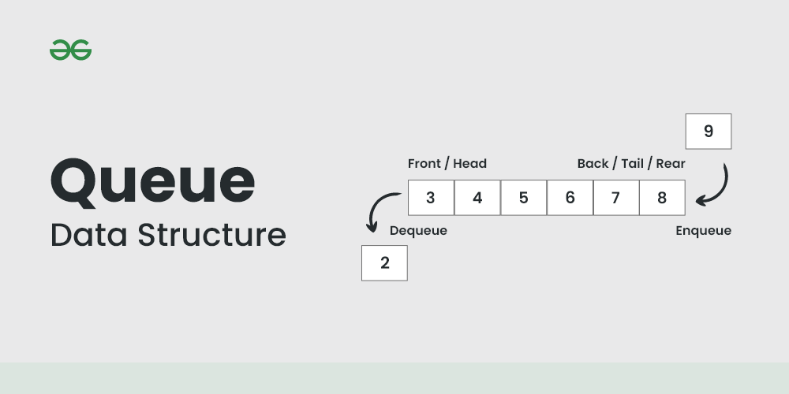

# Queue with Linked List Implementation

This document explains the current Java implementation of a **Queue using a Singly Linked List**.

The implementation contains:

- `Queue_Node`
- `Queue_with_LinkedList`

## Visual Representation



The Queue follows:

```text
FIFO — First In, First Out
```

New elements are added at the `last`, while elements are removed from the `first`.

## Queue_Node

```java
public class Queue_Node {
    Object data;
    Queue_Node next;

    public Queue_Node(Object data){
        this.data = data;
        this.next = null;
    }
}
```

Each node contains:

- `data` — the value stored in the node.
- `next` — a reference to the next node.

The node is similar to the node used in a Singly Linked List.

## Queue_with_LinkedList

The Queue maintains three variables:

```java
Queue_Node first;
Queue_Node last;
int length;
```

### first

`first` points to the element at the **front** of the Queue.

This is the element that will be returned by `peek()` and removed by `Dequeue()`.

### last

`last` points to the element at the **back** of the Queue.

New elements are added after `last`.

### length

`length` stores the number of elements currently inside the Queue.

## Peek

```java
public Object peek()
```

`peek()` returns the data stored in `first`.

If the Queue is empty:

```java
return null;
```

Example:

```text
first
  ↓
[3] → [4] → [5]
              ↑
             last
```

```text
peek() → 3
```

The Queue is not modified.

### Complexity

**O(1)**

The implementation directly accesses `first`.

## Enqueue

```java
public void enqueue(Object value)
```

`enqueue()` adds a new node to the back of the Queue.

### Empty Queue

When the Queue is empty:

```java
this.first = this.last = node;
```

Both references point to the new node.

```text
first
  ↓
[3]
  ↑
last
```

### Non-empty Queue

For an existing Queue:

```java
last.next = node;
last = node;
```

This connects the new node after the current last node and then moves `last` to the new node.

Example:

```text
Before:

first                    last
  ↓                        ↓
[3] → [4] → [5]

enqueue(6)

After:

first                           last
  ↓                               ↓
[3] → [4] → [5] → [6]
```

### Complexity

**O(1)**

Because the implementation maintains a direct reference to `last`.

## Dequeue

```java
public Object Dequeue()
```

`Dequeue()` removes and returns the element at the front.

### Step 1 — Store the value

```java
Object value = first.data;
```

The value of the first node is saved so it can be returned.

### Step 2 — Move first

```java
first = first.next;
```

The second node becomes the new front.

### Step 3 — Decrease length

```java
length--;
```

### Step 4 — Handle the empty Queue

If the removed element was the only element:

```java
if(length == 0){
    last = null;
}
```

This keeps `last` consistent with the empty Queue.

Example:

```text
Before:

first
  ↓
[3] → [4] → [5]
              ↑
             last

Dequeue() → 3

After:

first
  ↓
[4] → [5]
        ↑
       last
```

### Complexity

**O(1)**

Only the `first` reference needs to be moved.

## Empty Queue

Both `peek()` and `Dequeue()` check:

```java
if (length == 0)
```

and return `null` when the Queue is empty.

This prevents accessing `first.data` when there is no node.

## Complexity Summary

| Operation | Complexity |
|---|---:|
| `peek()` | O(1) |
| `enqueue()` | O(1) |
| `Dequeue()` | O(1) |

The implementation achieves constant-time insertion and removal because it maintains references to both ends of the Queue.

## Implementation Notes

The current implementation uses `Object` for the stored data:

```java
Object data;
```

This allows different object types to be stored, but it does not provide compile-time type safety.

A generic version could later use:

```java
Queue_Node<T>
```

The current implementation is focused on demonstrating the Queue data structure and its FIFO behavior.
