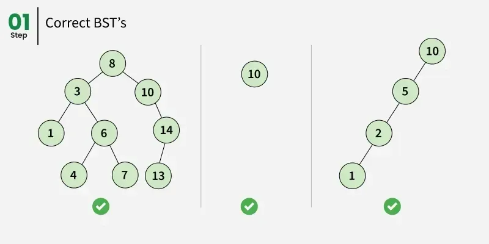
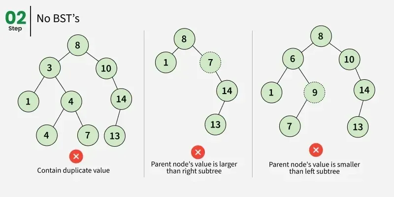

# Binary Search Tree Implementation

This document explains the provided Java implementation of a **Binary Search Tree (BST)**.

The `BinarySearchTree` class is used to represent both individual tree nodes and the object that owns the `root` reference.



The BST ordering rule is:

```text
left subtree < node < right subtree
```

The second diagram shows examples that violate the BST rule:



## Class Structure

```java
public class BinarySearchTree {
    public BinarySearchTree left;
    public BinarySearchTree right;
    public int value;
}
```

Each node contains:

- `value` — the integer stored in the node.
- `left` — reference to the left child.
- `right` — reference to the right child.

The class also contains:

```java
BinarySearchTree root = null;
```

which represents the root of the tree owned by the object.

## Constructors

### Empty Constructor

```java
public BinarySearchTree(){}
```

Creates an object without explicitly assigning the fields.

### Value Constructor

```java
public BinarySearchTree(int value){
    this.left = null;
    this.right = null;
    this.value = value;
}
```

Creates a node with the supplied value and no children.

## root

```java
BinarySearchTree root = null;
```

Initially the tree is empty:

```text
root -> null
```

After inserting the first value:

```text
root
  |
 [10]
```

## insert()

```java
public void insert(int value)
```

Adds a new value while following the BST ordering rule.

### 1. Create the New Node

```java
BinarySearchTree newNode = new BinarySearchTree(value);
```

### 2. Empty Tree

```java
if (this.root == null) {
    this.root = newNode;
    return;
}
```

The first inserted node becomes the root.

### 3. Traverse the Tree

```java
BinarySearchTree currentNode = this.root;
```

The method then repeatedly compares `value` with `currentNode.value`.

If:

```java
value < currentNode.value
```

it moves left.

If the left child is empty, the new node is inserted there.

Otherwise, it continues from the left child.

For the other branch, the implementation moves right and inserts there when the right child is empty.

### Duplicate Values

The current implementation uses `else` for the right side. Therefore, when:

```java
value == currentNode.value
```

the value is placed in the right subtree.

So **this implementation allows duplicates and sends equal values to the right**.

## insert() Complexity

The running time depends on tree height `h`:

```text
O(h)
```

Therefore:

- Balanced tree -> approximately O(log n)
- Highly unbalanced tree -> O(n)

The implementation uses an iterative loop.

## lookUp()

```java
public BinarySearchTree lookUp(int value)
```

Searches for a value using the BST ordering rule.

The method starts at the root:

```java
BinarySearchTree currentNode = this.root;
```

Then:

```java
if (value < currentNode.value)
```

goes left.

```java
else if (value > currentNode.value)
```

goes right.

Otherwise, the value is equal and the current node is returned.

If traversal reaches `null`, the method returns `null` because the value was not found.

## lookUp() Complexity

```text
O(h)
```

So it is approximately O(log n) for a balanced tree and O(n) in the worst case.

## remove()

```java
public boolean remove(int value)
```

The method first searches for the target while keeping both:

```java
BinarySearchTree currentNode = this.root;
BinarySearchTree parent = null;
```

`currentNode` is the node being examined and `parent` is its parent.

## Removal Case 1 — No Right Child

```java
if (currentNode.right == null)
```

The implementation connects the parent to `currentNode.left`.

If the target is the root, it uses:

```java
this.root = currentNode.left;
```

This covers a leaf and a node with only a left child.

## Removal Case 2 — Right Child Has No Left Child

```java
else if (currentNode.right.left == null)
```

The right child can act as the replacement node. The implementation also attaches the removed node's left subtree to that replacement.

Conceptually:

```text
        current
       /      \\
    left      right
```

where `right.left == null`.

## Removal Case 3 — Right Subtree Has a Leftmost Node

Otherwise, the implementation searches for the leftmost node in the right subtree:

```java
BinarySearchTree leftMost = currentNode.right.left;
BinarySearchTree leftMostParent = currentNode.right;
```

Then it repeatedly moves left:

```java
while (leftMost.left != null){
    leftMostParent = leftMost;
    leftMost = leftMost.left;
}
```

This finds the smallest value in the right subtree, which is used as an **in-order successor**.

The implementation then reconnects the successor with the current node's left and right subtrees.

## remove() Complexity

Like insertion and lookup, removal depends on the tree height:

```text
O(h)
```

- Balanced -> O(log n)
- Worst case -> O(n)

## Important Notes About the Current Code

This README documents the code as provided and does not silently modify it.

### 1. Duplicate Policy

`insert()` sends equal values to the right subtree. Therefore, the implementation does not use a strict no-duplicates policy.

### 2. Root Removal in Case 2

In this branch:

```java
else if (currentNode.right.left == null)
```

the root case currently contains:

```java
if(parent == null){
    this.root = currentNode.left;
}
```

However, this branch is preparing `currentNode.right` as the replacement. This line should be reviewed because assigning the root to `currentNode.left` can discard the intended right-side replacement/subtree.

### 3. remove() Return Value

The method ends with:

```java
return true;
```

even after the search loop finishes without finding the value. Therefore, the current implementation can report `true` even when the requested value was not found.

### 4. Public Node Fields

The fields are declared `public`:

```java
public BinarySearchTree left;
public BinarySearchTree right;
public int value;
```

This makes the internal node structure directly accessible from outside the class.

### 5. Node and Tree in One Class

The same class represents both a node and the tree holder containing `root`. This keeps the learning example compact, although a separate `Node` class is another common design.

## Complexity Summary

| Operation | Average / Balanced | Worst Case |
|---|---:|---:|
| `insert()` | O(log n) | O(n) |
| `lookUp()` | O(log n) | O(n) |
| `remove()` | O(log n) | O(n) |

The key factor is the **height of the tree**.
